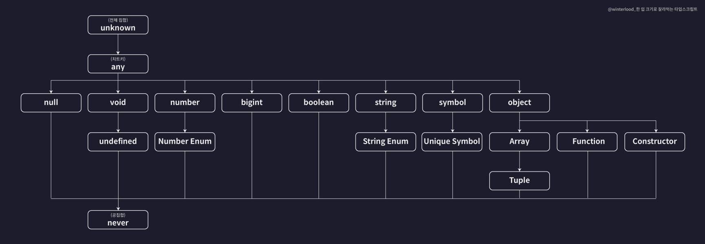
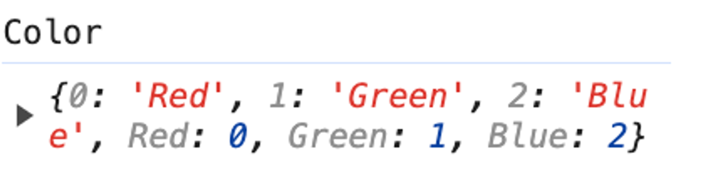
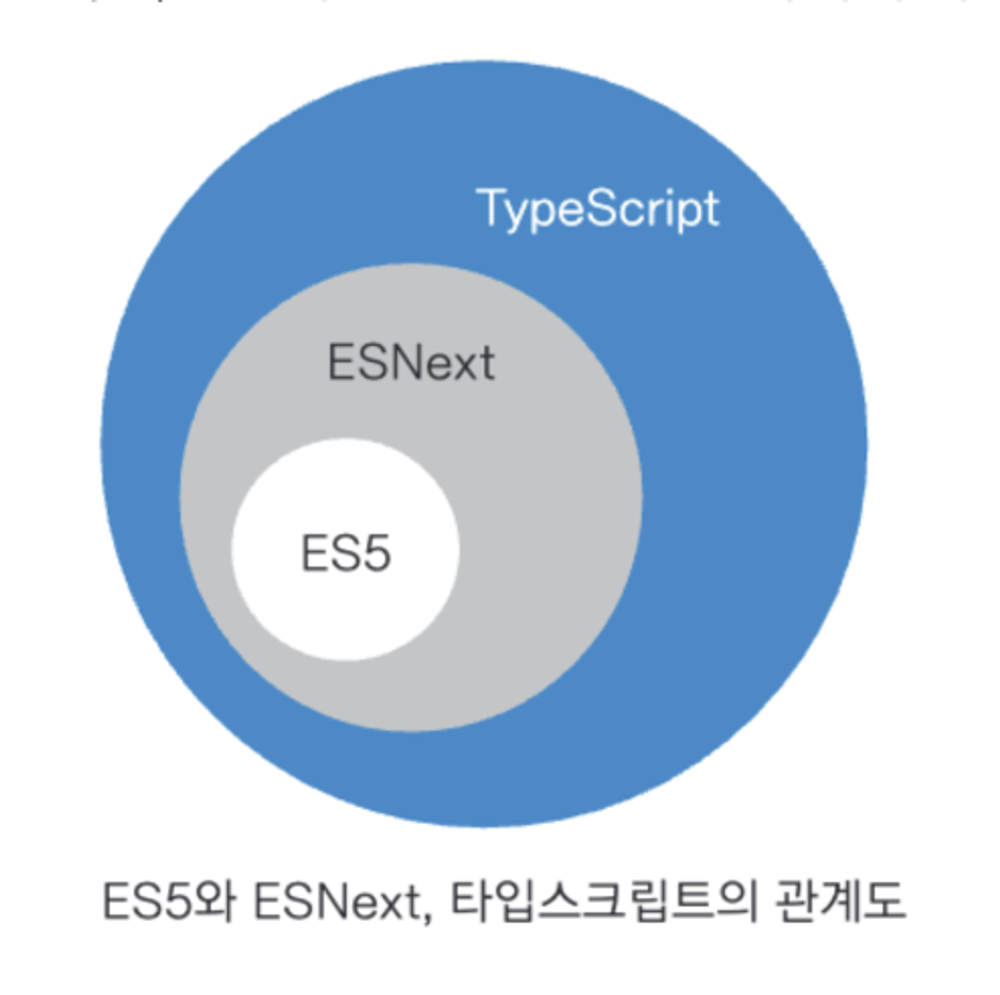
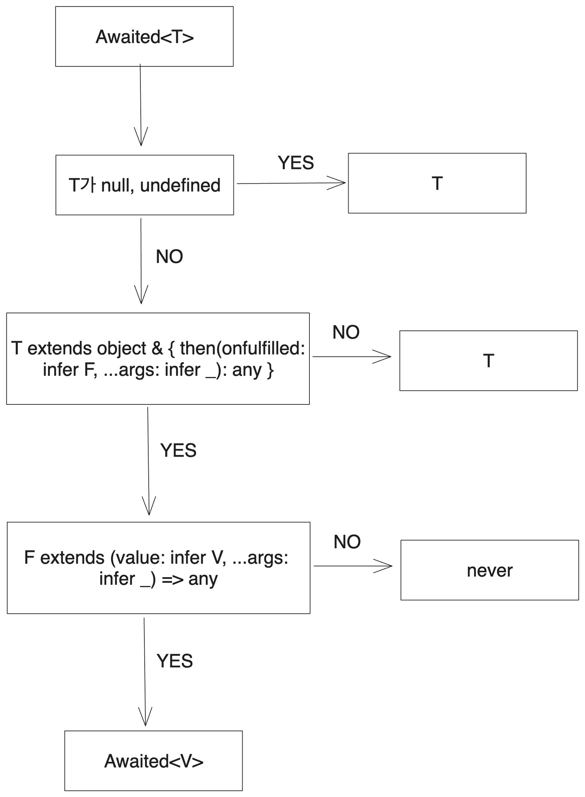

타입스크립트 집합 관계



### unknown

가장 넓은 범위의 타입

`unknown`을 다른 타입의 변수에 할당하는 것은 불가능 합니다.

강제 타입 캐스팅시에 아래와 같이 `as unknown as Type` 형태로 사용되기는 합니다.

any 보다는 우선적으로 사용합니다.

타입 캐스팅 예시

```tsx
props.onChange?.(event as unknown as React.ChangeEvent<HTMLInputElement>);
```

### void

`void` 타입인 변수에는 undefined 또는 null을 할당할 수 있으며 strictNullChecks 옵션이 활성화되어 있으면 undefined만 할당 가능하다.

반환값이 없는 함수는 타입스크립트가 알아서 `void`로 타입을 추론해주기 때문에 명시할 필요는 굳이 없다

```tsx
const returnUndefined = () => {
  // const returnUndefined: () => void
  return;
};
```

### never

가장 좁은 범위의 타입

`never`는 값을 반환할 수 없는 타입을 말한다.

`never`에는 `never`만 할당이 가능하며 `any` 타입도 할당할 수 없습니다.

에러를 throw 하는 함수의 경우 return 타입이 never 이다.

```tsx
const throwError = () => {
  // const throwError: () => never
  throw new Error("error");
};
```

조건부 타입을 결정할 때 특정 조건을 만족하지 않는 경우에 엄격한 타입 검사 목적으로 never를 명시적으로 사용하기도 합니다.

### Array

배열 타입을 가리키는 Array 키워드는 자바스크립트에서도 `Object.prototype.toString.call(…)` 연산자를 사용해 확인할 수 있다.

`typeof` 연산자는 객체 타입을 단순히 `object` 타입으로 알려주지만, 위 함수는 객체의 인스턴스까지 알려줍니다.

하지만 엄밀히 말하면 자바스크립트에서 배열은 객체에 속하는 타입으로 배열을 단독으로 배열이라는 자료형에 국한하지 않고 따라서 타입스크립트에서 Array 타입이 추가되었습니다.

```jsx
arr = [1, 2, 3];
Object.prototype.toString.call(arr); // '[object Array]'
```

아래 두개는 동일한 `Array` 타입을 반환합니다.

```jsx
const arr: number[] = [1, 2, 3];
const arr2: Array<number> = [1, 2, 3];
```

아래와 같이 특정 index에 정해진 타입을 강제하는 경우 tuple 타입으로 구분됩니다.

예를들어 React에서 `useState`는 튜플타입을 반환합니다.

```tsx
const tupple: [number, string] = [1, "1"];
const [state, setState] = useState();
```

배열의 스프레드 연산자를 통해 아래와 같이 튜플과 배열을 동시에 사용하는 것도 가능합니다.

```jsx
const httpStatusFormPaths: [number, string, ...string[]] = [
  200,
  'OK',
  'OK',
  'OK',
  'OK',
  'OK',
  'OK',
];

```

옵셔널한 인덱스도 tuple로 표현 가능합니다.

```jsx
const optionalTuple: [number, string?] = [1];
const optionalTuple2: [number, string?] = [1, '1'];
```

### enum

열거형 이라고도 부르며 주로 *문자열 상수*를 생성하는데 사용됩니다. `enum`의 사용은 타입안정성과 코드 가독성을 높여줍니다.

```tsx
enum ProgramingLanguage {
  JavaScript = "JavaScript",
  TypeScript = "TypeScript",
  Python = "Python",
}

ProgramingLanguage.JavaScript; // 'JavaScript'

const consoleLogProgramingLanguage = (language: ProgramingLanguage) => {
  switch (language) {
    case ProgramingLanguage.JavaScript:
      console.log("JavaScript");
      break;
    case ProgramingLanguage.TypeScript:
      console.log("TypeScript");
      break;
    case ProgramingLanguage.Python:
      console.log("Python");
      break;
    default:
      return;
  }
};
```

각 멤버에 값을 할당하지 않으면 0부터 1씩 늘려가며 자동으로 할당합니다.

```tsx
enum ProgramingLanguage {
  JavaScript, // 0
  TypeScript, // 1
  Python, // 2
}
```

단 value가 숫자로만 이루어져 있거나 타입스크립트가 자동으로 추론한 열거형은 안전하지 않을 수 있습니다.

이는 역방향 접근이 가능하기 때문인데 할당한 값을 넘어서는 범위로 접근해도 타입스크립트는 막지 않습니다.

```tsx
enum ProgramingLanguage {
  JavaScript,
  TypeScript,
  Python,
}

console.log(ProgramingLanguage[100]); // undefined
```

const enum의 경우 역방향 접근을 막아 이를 해소할 수 있지만 ~~여전히 숫자 상수로 관리되는 열거형인 경우 선언한 값 이외의 값을 할당하거나 접근할 때 이를 방지할 수 없습니다.~~ 따라서 문자열 상수 enum을 사용하는 것이 안전합니다.

```tsx
const enum ProgramingLanguage {
  JavaScript,
  TypeScript,
  Python,
}

const myLang = ProgramingLanguage[0]; // A const enum member can only be accessed using a string literal.ts(2476)
```

```tsx
enum ProgramingLanguage {
  JavaScript = 0,
  TypeScript = 1,
  Python = 2,
}

const myLang: ProgramingLanguage = 100; // 에러인데?? 책 내용이랑 다름
```

`enum`은 타입공간과 값 공간에 모두 사용되기에 타입스크립트 코드가 자바스크립트 코드로 변환될 때에는 즉시 실행 함수(IIFE)로 변환되고 이는 해당 enum 객체를 함수로 만들어서 반환합니다.

```tsx
enum Color {
  Red,
  Green,
  Blue,
}
```

```tsx
"use strict";
var Color;
(function (Color) {
  Color[(Color["Red"] = 0)] = "Red";
  Color[(Color["Green"] = 1)] = "Green";
  Color[(Color["Blue"] = 2)] = "Blue";
})(Color || (Color = {}));
```

아래와 같은 객체를 반환하게 됩니다. 다만 일부 번들러에서 트리쉐이킹 과정 중 번들크기 증가에 대한 우려가 있습니다.

\*Tree-shaking이란 컴파일 과정에서 사용하지 않는 코드를 제거해서 코드를 가볍게 만드는 최적화 과정을 말하고 주로 번들러에서 이를 수행합니다. 컴파일 과정에서 `enum`은 IIFE(즉시 실행 함수)로 컴파일 되기 때문에 enum 변수가 쓰이지 않더라도 의 구현과정에서 이미 코드는 자체적으로 쓰이게 됩니다.

위 즉시실행함수를 실행하면 아래와 같이 됩니다.



### enum vs const enum vs as const

enum은 value가 상수인경우 역방향 Mapping이 가능하고 const enum, as const는 어느 경우에도 역방향 Mapping이 불가능합니다.

```tsx
enum STATUS {
  SUCCESS,
  ERROR,
}

const enum STATUS2 {
  SUCCESS,
  ERROR,
}

STATUS[0];
ResponseCode[0]; // error
```

const enum은 해당 변수를 사용하지 않는 경우 컴파일 자체가 생략되며 변수를 사용하는 경우 아래와 같은 형식으로 inlined 처리 됩니다.

```tsx
const enum Direction {
  Up,
  Down,
  Left,
  Right,
}

let directions = [
  Direction.Up,
  Direction.Down,
  Direction.Left,
  Direction.Right,
];

// .JS 컴파일 결과
("use strict");
let directions = [
  0 /* Direction.Up */, 1 /* Direction.Down */, 2 /* Direction.Left */,
  3 /* Direction.Right */,
];

const direction = {
  Up: "UP",
} as const;
```

…결론만

문자열 상수를 사용하고 싶으면 enum을 쓰냐 as const를 쓰나 상관 없음

양방향 Mapping이 굳이 필요 없고, Value만 받아와서 Literal Type으로 지정하고 싶다면 as const 문법을 쓰면 충분

양방향 Mapping이 필요하다면 enum을

const enum → 쓰지 말자

하지만 다른 언어와 호환가능하다는 점에서 enum이 필요한 경우도 있음 예를들어 서버와 데이터를 주고 받을때 enum으로 값들을 전달받으면 타입 안정성을 서로 보장할 수 있음.

### keyof

`keyof` 연산자는 객체 타입의 모든 키를 유니언 타입으로 반환합니다. 타입스크립트에서만 사용가능한 키워드입니다.

```tsx
type Person = {
  name: string;
  age: number;
  isEmployed: boolean;
};

type PersonKeys = keyof Person; // "name" | "age" | "isEmployed"
```

객체의 키를 유니온 타입으로 가져올때 아래처럼 사용합니다.

```tsx
const casettesByArtist = {
  "Alanis Morissette": 2,
  "Mariah Carey": 8,
  Nirvana: 3,
  Oasis: 2,
  Radiohead: 3,
  "No Doubt": 3,
  "Backstreet Boys": 3,
  "Spice Girls": 2,
  "Green Day": 2,
  "Pearl Jam": 5,
  Metallica: 5,
  "Guns N' Roses": 2,
  U2: 3,
  Aerosmith: 4,
  "R.E.M.": 4,
  Blur: 3,
  "The Smashing Pumpkins": 5,
  "Britney Spears": 3,
  "Whitney Houston": 3,
};

type Artist = keyof typeof casettesByArtist;
```

### Index Signature

[key: K] : T 꼴로 명시해주면 되고 해당 타입의 속성 키는 모두 K여야 하고 값은 T 타입을 가져야 한다는 의미입니다.

```tsx
interface Example {
  [key: string]: number;
}
```

### Indexted Access Types

다른 타입의 특정 속성이 가지는 타입을 조회하기 위해 사용됩니다. 아래처럼 사용합니다.

```tsx
interface Props {
  isOpen: boolean;
  chat: Message | DetailedMessage | TypingMessage;
  isMine: boolean;
  name: string;
  onChangeHeight?: (height: number) => void;
}

type IsOpen = Props["isOpen"]; // boolean
type PropsKeys = Props[keyof Props]; // type PropsKeys = string | boolean | Message | DetailedMessage | TypingMessage | ((height: number) => void) | undefined
```

### infer

`infer` 키워드는 TypeScript의 조건부 타입(conditional types)에서 사용되며, 타입을 추론하는 데 사용됩니다. `infer`를 사용하면 조건부 타입의 `extends` 절에서 특정 부분의 타입을 추론하고, 그 추론된 타입을 조건부 타입의 다른 부분에서 사용할 수 있습니다.

아래와 같이 사용합니다.

```tsx
const promotionList = [
  {
    title: "title",
    description: "description",
    price: 100,
  },
  {
    title: "title",
    description: "description",
    price: 100,
  },
];

type ElementOf<T> = T extends (infer E)[] ? E : never;
type Promotion = ElementOf<typeof promotionList>;
```

```tsx
type FirstElement<T> = T extends [infer U, ...any[]] ? U : never;

type Tuple1 = [number, string, boolean];
type Tuple2 = [string, number];

type FirstOfTuple1 = FirstElement<Tuple1>; // number
type FirstOfTuple2 = FirstElement<Tuple2>; // string
```

```tsx
type Parameters<T extends (...args: any) => any> = T extends (
  ...args: infer P
) => any
  ? P
  : never;
```

\*타입크립트에서 조건부 타입

조건부 타입 정의시에 `extends` 를 조건문(if)으로 사용합니다.

아래 조건문은 타입 T에서 타입 U를 제거한 타입을 반환합니다. (T를 U를 할당할 수 있는지 확인)

```tsx
type Exclude<T, U> = T extends U ? never : T;
```

### mapped type

매핑된 타입은 기존 타입의 속성들을 변환하여 새로운 타입을 만드는 방법입니다. 이는 특정 타입의 각 속성에 일관된 변환을 적용해야 할 때 매우 유용합니다.

```tsx
type Person = {
  name: string;
  age: number;
  isEmployed: boolean;
};

type PartialPerson = {
  [P in keyof Person]?: Person[P];
};

// 아래와 같습니다
type PartialPerson = {
  name?: string;
  age?: number;
  isEmployed?: boolean;
};
```

매핑된 타입을 사용하여 제너릭으로 받은 type을 readonly 및 nullable 하게 만드는 예제입니다.

```tsx
type Person = {
  name: string;
  age: number;
  isEmployed: boolean;
};

type ReadonlyNullable<T> = {
  readonly [P in keyof T]: T[P] | null;
};

type ReadonlyNullablePerson = ReadonlyNullable<Person>;
```

\*추가적인 정보

자바스크립트에서 객체의 키는 string | number | string 이며 이를 나타내기 위한 `PropertyKey` 타입이 존재합니다.

```tsx
declare type PropertyKey = string | number | symbol;
```

### Promise Type

Promise vs PromiseLike

타입스크립트에서는 Promise를 지원하기 위한 타입으로 `Promise` , `PromiseLike` 가 있는데

이는 자바스크립트에서 Promise가 처음 등장했을때에는 then method만 지원하였고 이후 catch, finally method가 점차적으로 추가되었는데 이러한 호환성 문제를 위해 then method만 가지는 `PromiseLike` 을 별도로 지원합니다.

또한 두 타입의 정의를 보면 재귀적으로 `Promise`를 반환하는 것을 볼 수 있습니다. `.then` 콜백 지옥 ㅆ가능

```tsx
// lib.es5.d.ts -> Promise 지원 전인데 있네? -> es5 환경에서도 Prmoise 지원하도록 추가 되었다고 함

interface PromiseLike<T> {
  then<TResult1 = T, TResult2 = never>(
    onfulfilled?:
      | ((value: T) => TResult1 | PromiseLike<TResult1>)
      | undefined
      | null,
    onrejected?:
      | ((reason: any) => TResult2 | PromiseLike<TResult2>)
      | undefined
      | null
  ): PromiseLike<TResult1 | TResult2>;
}

interface Promise<T> {
  then<TResult1 = T, TResult2 = never>(
    onfulfilled?:
      | ((value: T) => TResult1 | PromiseLike<TResult1>)
      | undefined
      | null,
    onrejected?:
      | ((reason: any) => TResult2 | PromiseLike<TResult2>)
      | undefined
      | null
  ): Promise<TResult1 | TResult2>;

  catch<TResult = never>(
    onrejected?:
      | ((reason: any) => TResult | PromiseLike<TResult>)
      | undefined
      | null
  ): Promise<T | TResult>;
}
```

```tsx
// lib.es2018.promise.d.ts 여기에서 finally method 지원

interface Promise<T
    finally(onfinally?: (() => void) | undefined | null): Promise<T>
}
```

먼저, ES5는 ECMAScript5의 줄임말로 웹 브라우저에서 동작하는 표준 자바스크립트입니다.

ESNext는 ES6 이후 버전을 통틀어 부르는 "새로운 자바스크립트"입니다.

ES6에 추가된 대표적인 문법으로는 const, arrow function, Promise, module(import, export), class등이 있습니다.

ES5(2009) → Typescript(2012, Microsoft) → ES6(2015)



### Awaited

```tsx
/**
 * Recursively unwraps the "awaited type" of a type. Non-promise "thenables" should resolve to `never`. This emulates the behavior of `await`.
 */
type Awaited<T> = T extends null | undefined
  ? T // special case for `null | undefined` when not in `--strictNullChecks` mode
  : T extends object & { then(onfulfilled: infer F, ...args: infer _): any } // `await` only unwraps object types with a callable `then`. Non-object types are not unwrapped
  ? F extends (value: infer V, ...args: infer _) => any // if the argument to `then` is callable, extracts the first argument
    ? Awaited<V> // recursively unwrap the value
    : never // the argument to `then` was not callable
  : T; // non-object or non-thenable
```

Awaited 타입의 조건문을 해석하면 아래 도표와 같습니다.

lib.es5.d.ts에서 정의되어 있는 유틸리티 타입 정의 들

```tsx
interface ArrayLike<T> {
  readonly length: number;
  readonly [n: number]: T;
}

/**
 * Make all properties in T optional
 */
type Partial<T> = {
  [P in keyof T]?: T[P];
};

/**
 * Make all properties in T required
 */
type Required<T> = {
  [P in keyof T]-?: T[P];
};

/**
 * Make all properties in T readonly
 */
type Readonly<T> = {
  readonly [P in keyof T]: T[P];
};

/**
 * From T, pick a set of properties whose keys are in the union K
 */
type Pick<T, K extends keyof T> = {
  [P in K]: T[P];
};

/**
 * Construct a type with a set of properties K of type T
 */
type Record<K extends keyof any, T> = {
  [P in K]: T;
};

/**
 * Exclude from T those types that are assignable to U
 */
type Exclude<T, U> = T extends U ? never : T;

/**
 * Extract from T those types that are assignable to U
 */
type Extract<T, U> = T extends U ? T : never;

/**
 * Construct a type with the properties of T except for those in type K.
 */
type Omit<T, K extends keyof any> = Pick<T, Exclude<keyof T, K>>;

/**
 * Exclude null and undefined from T
 */
type NonNullable<T> = T & {};

/**
 * Obtain the parameters of a function type in a tuple
 */
type Parameters<T extends (...args: any) => any> = T extends (
  ...args: infer P
) => any
  ? P
  : never;

/**
 * Obtain the parameters of a constructor function type in a tuple
 */
type ConstructorParameters<T extends abstract new (...args: any) => any> =
  T extends abstract new (...args: infer P) => any ? P : never;

/**
 * Obtain the return type of a function type
 */
type ReturnType<T extends (...args: any) => any> = T extends (
  ...args: any
) => infer R
  ? R
  : any;

/**
 * Obtain the return type of a constructor function type
 */
type InstanceType<T extends abstract new (...args: any) => any> =
  T extends abstract new (...args: any) => infer R ? R : any;
```

헷갈리는거

Pick<Type, Keys> vs Extract<Type, Union>

Pick은 객체형태의 타입에서 사용 Extract는 유니온 타입에서 사용

`TypeScript`의 `tsconfig.json` 파일에서 `compilerOptions`의 `target` 옵션은 `TypeScript` 코드가 어떤 버전의 JavaScript로 변환될지를 결정합니다.

`target` 옵션은 `TypeScript` 컴파일러가 생성할 JavaScript의 버전을 지정합니다. 여기서 `es5`는 ECMAScript 5를 의미합니다. 이는 주로 ES2015(ES6) 이전의 JavaScript 환경에서 호환성을 유지하기 위해 사용됩니다.

```json
{
  "compilerOptions": {
    "target": "es5",
    ...
  }
}
```

### Refs

https://witch.work/posts/typescript-promise-type

https://jaenny-dev.tistory.com/5

https://xpectation.tistory.com/218
