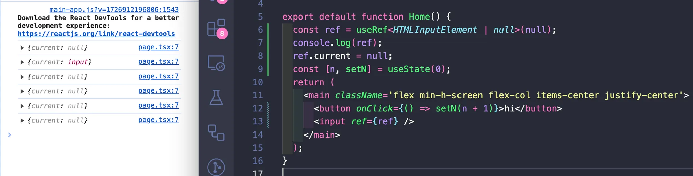
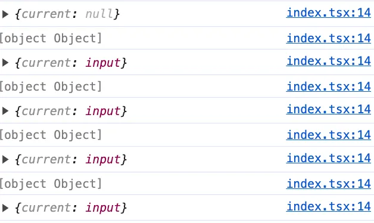
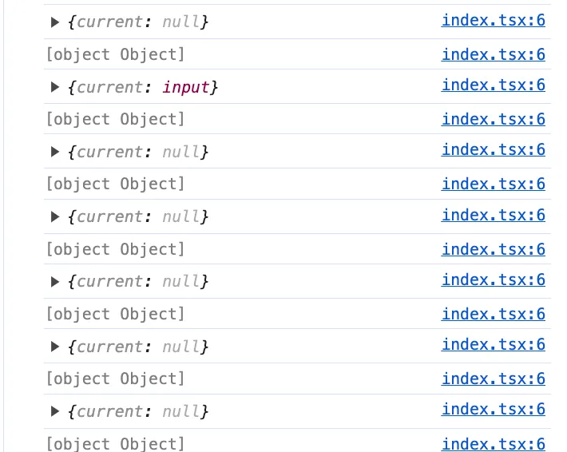

### useRef

초기값으로 undefined를 넣은 경우 MutableRefObject 타입이 되어서 ref.current 값을 변경 가능하다.

```tsx
// useRef<number>(): MutableRefObject<number | undefined>
const ref = useRef<number>();
ref.current = 1;
```

Generic으로 직접 null을 명시한 경우에도 MutableRefObject로 타입이 잡혀서 값 변경이 가능해진다.

```tsx
const ref = useRef<number | null>(null);
ref.current = 1;
```

초기값으로 null을 넣어주면 RefObject 타입이 되어서 ref.current 값을 변경할 수 없다.

DOM에 있는 값을 참조할때는 초기값으로 null을 넣어주는 것이 안전해 보인다.

```tsx
// useRef<number>(initialValue: number | null): RefObject<number>
const ref = useRef<number>(null);
ref.current = 1; // Cannot assign to 'current' because it is a read-only property.ts(2540
```



useRef의 함수 타입을 보면 null을 Generic이 아닌 인자로 넣어준 경우에만 current가 readonly인 RefObject 타입을 반환하는 것을 확인할 수 있다.

```tsx
function useRef<T>(initialValue: T): MutableRefObject<T>;
function useRef<T>(initialValue: T | null): RefObject<T>;
function useRef<T = undefined>(): MutableRefObject<T | undefined>;

interface MutableRefObject<T> {
  current: T;
}

interface RefObject<T> {
  readonly current: T | null;
}
```

useRef에 인자로 아무값도 넣지 않으면 MutableRefObject<HTMLInputElement | undefined>로 추론되어서 ref에 DOM 참조를 넣을 수 없다.

```tsx
export default function Test() {
  const [number, setNumber] = useState(0);
  const ref = useRef<HTMLInputElement>();
  console.log(ref);
  return (
    <div>
      <h1>{number}</h1>
      <input ref={ref} /> // error
      <button onClick={() => setNumber((n) => n + 1)}>rerender</button>
    </div>
  );
}
```

```tsx
Type 'MutableRefObject<HTMLInputElement | undefined>' is not assignable to type 'LegacyRef<HTMLInputElement> | undefined'.
```

실험

Dom과 연결된 후 참조를 리렌더링이 되어도 참조가 변하지 않는다.

```tsx
import { useRef, useState } from "react";

export default function Test() {
  const [number, setNumber] = useState(0);
  const ref = useRef<HTMLInputElement>(null);
  console.log(ref);
  return (
    <div>
      <h1>{number}</h1>
      <input ref={ref} />
      <button onClick={() => setNumber((n) => n + 1)}>rerender</button>
    </div>
  );
}
```



제너릭으로 HTMLInputElement | null을 주면 ref.current 값을 변경할 수 있게 되고 이경우 null을 다시 넣어주면 ref 값이 3번째 렌더링부터는 계속 null이 된다.

```tsx
import { useRef, useState } from "react";

export default function Test() {
  const [number, setNumber] = useState(0);
  const ref = useRef<HTMLInputElement | null>(null);
  console.log(ref);
  ref.current = null;
  return (
    <div>
      <h1>{number}</h1>
      <input ref={ref} />
      <button onClick={() => setNumber((n) => n + 1)}>rerender</button>
    </div>
  );
}
```



forwardRef에서 ref의 타입을 위해 넣어주는 T는 최종적으로 ForwardedRef<T>로 전달되는데 ForwardedRef<T>는 MutableRefObject<T | null>를 반환하는 함수 타입이다. MutableRefObject가 RefObject보다 넓은 타입이기 때문에 부모컴포넌트에서 ref를 어떻게 선언했는지와 관계없이 자식 컴포넌트가 ref를 수용할 수 있다.

```tsx
function forwardRef<T, P = {}>(
  render: ForwardRefRenderFunction<T, P>
): ForwardRefExoticComponent<PropsWithoutRef<P> & RefAttributes<T>>;

interface ForwardRefRenderFunction<T, P = {}> {
  (props: P, ref: ForwardedRef<T>): ReactNode;
  displayName?: string | undefined;
  // explicit rejected with `never` required due to
  // https://github.com/microsoft/TypeScript/issues/36826
  /**
   * defaultProps are not supported on render functions
   */
  defaultProps?: never | undefined;
  /**
   * propTypes are not supported on render functions
   */
  propTypes?: never | undefined;
}

type ForwardedRef<T> =
  | ((instance: T | null) => void)
  | MutableRefObject<T | null>
  | null;
```
