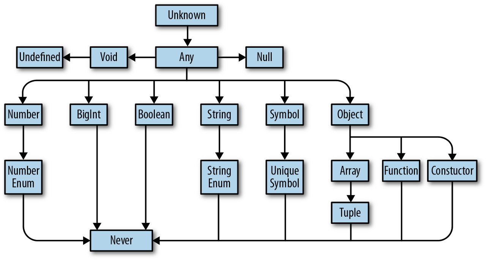

# 3장 고급타입

## 3.1 타입스크립트만의 독자적 타입 시스템

타입스크립트는 자바스크립트 자료형에서 제시되지 않은 독자적인 타입 시스템을 가지고 있지만 이는 모두 자바스크립트에서 기인한 것이다.

- 타입스크립트의 타입 계층 구조
  

### 1. any 타입

any 타입은 자바스크립트에 존재하는 모든 값을 오류 없이 받을 수 있다. 타입을 명시하지 않은 것과 동일한 효과를 나타낸다. any 타입을 변수에 할당하는 것은 지양해야 할 패턴이지만 어쩔 수 없이 사용해야 할 때가 있다.

- 개발 단계에서 임시로 값을 정해야 할 때

  개발 과정에서 추후 값이 변경될 가능성이 있거나 아직 세부 항목에 대한 타입이 확정되지 않은 경우가 생길 수 있다. 이때 해당 값을 any로 지정하여 경고 없이 개발을 계속한다. 타입을 세세하게 명시하는 데 소요되는 시간을 절약한다.
  타입에 대한 세부 스펙이 나오는 시점에는 다른 타입으로 대체한다.

- 어떤 값을 받아올지 또는 넘겨줄지 정할 수 없을 때

  예시로 API 요청 및 응답 처리, 콜백 함수 전달, 타입이 잘 정제되지 않아 파악이 힘든 외부 라이브러리 등을 사용할 때는 어떤 인자를 주고받을지 특정하기 힘들다.

- 값을 예측할 수 없을 때 암묵적으로 사용

  외부 라이브러리나 웹 API 요청에 따라 다양한 값을 반환하는 API가 존재할 수 있다. 대표적인 예로 브라우저의 FEtch API가 있다.

### 2. unknown 타입

unknown 타입은 any 타입과 유사하게 모든 타입의 값이 할당될 수 있지만 any를 제외한 다른 타입으로 선언된 변수에는 unknown 타입 값을 할당할 수 없다.

```ts
let unknownValue: unknown;

unknownValue = 100; // any 타입과 유사하게 숫자이든
unknownValue = "hello world"; // 문자열이든
unknownValue = () => console.log("this is any type"); // 함수이든상관없이할당이가능하지만

let someValue1: any = unknownValue; // (O) any 타입으로 선언된 변수를 제외한 다른 변수는 모두 할당이 불가
let someValue2: number = unknownValue; // (X)
let someValue3: string = unknownValue; // (X)
```

any타입과 비슷한데 왜 필요한가?

```ts
// 할당하는 시점에서는 에러가 발생하지 않음
const unknownFunction: unknown = () => console.log("this is unknown type");

// 하지만 실행 시에는 에러가 발생; Error: Object is of type 'unknown'.ts (2571)
unknownFunction();
```

위처럼 unknown은 할당 시점에는 문제가 없지만 호출 시 문제가 생긴다. unkonw 타입은 어떤 타입이 할당되었는지 알 수 없어 unknown 타입으로 선언된 변수는 값을 가져오거나 내부 속성에 접근할 수 없다. 이는 개발자에게 엄격한 타입 검사를 강제하는 의도를 담고 있다.

any 타입을 임시로 사용했다가 나중에 any 타입을 특정 타입으로 수정해야 하는 것을 깜빡하고 누락하면 버그가 발생할 수 있기 있는데 unknown 타입을 사용하면 이런 상황을 보완해준다.

### 3. void 타입

자바스크립트에서는 함수에서 명시적인 반환문을 작성하지 않으면 기본적으로 undefined가 반환된다. 하지만 타입스크립트에서는 void 타입이 사용되는데 이것은 undefined가 아니다.

void 타입은 주로 함수 반환 타입으로 사용되지만 함수에 국한된 것은 아니고 변수에도 할당할 수 있다. 하지만 함수가 아닌 값에 대해서는 대부분 무의미하다. void 타입으로 지정된 변수는 undefined 또는 null 값만 할당할 수 있다. 일반적으로 함수 자체를 다른 함수의 인자로 전달하는 경우가 아니라면 void 타입은 잘 명시하지 않는다. 함수 내부에 별도 반환문이 없다면 타입스크립트 컴파일러가 알아서 함수 타입을 void로 추론해주기 때문이다.

### 4. never 타입

never 타입은 값을 반환할 수 없는 타입을 말한다. 값을 반환하지 않는 것과 반환할 수 없는 것을 명확히 구분해야 한다. 자바스크립트에서 값을 반환할 수 없는 예는 크게 2가지다.

- 에러를 던지는 경우

  throw 키워드를 사용하면 에러를 발생시킬 수 있는데, 이는 값을 반환하는 것으로 간주하지 않는다. 따라서 특정 함수가 실행 중 마지막에 에러를 던지는 작업을 수행한다면 해당 함수의 반환 타입은 never이다.

- 무한히 함수가 실행되는 경우
  무한 루프는 결국 함수가 종료되지 않음을 의미하기 때문에 값을 반환하지 못한다.

never 타입은 모든 타입의 하위 타입이다(위 이미지 참고). 즉, never 자신을 제외한 어떤 타입도 never 타입에 할당될 수 없다. 타입스크립트에서는 조건부 타입을 결정할 때 특정 조건을 만족하지 않는 경우에 엄격한 타입 검사 목적으로 never 타입을 명시적으로 사용하기도 한다.

### 5. Array 타입

#### 자바스크립트에서도 확인할 수 있는 자료형인데도 왜 타입스크립트에서 다시 다루는가?

- 엄밀히 말하면 자바스크립트에서는 배열을 단독으로 배열이라는 자료형에 국한하지 않고 객체에 속하는 타입으로 분류한다.
- 타입스크립트에서 Array라는 타입을 사용하기 위해서는 타입스크립트의 특수한 문법을 함께 다뤄야 한다.

#### 타입 선언 방식

```ts
const array: number[] = [1, 2, 3]; // 숫자에 해당하는 원소만 허용한다
const array: Array<number> = [1, 2, 3];
// number[]와 동일한 타입이다
```

위의 두 방식 간의 차이점은 선언하는 형식 외에는 없다.

```ts
const array1: Array<number | string> = [1, "string"];
const array2: number[] | string[] = [1, "string"];

// 후자의 방식은 아래와 같이 선언할 수도 있다
const array3: (number | string)[] = [1, "string"];
```

위와 같이 유니온 타입으로 배열 내 여러 타입이 들어가게할 수도 있다.

#### 튜플

튜플은 배열 타입의 하위 타입으로 배열 기능에 길이 제한까지 추가한 타입 시스템이다.

```ts
let tuple: [number] = [1];
tuple = [1, 2]; // 불가능
tuple = [1, "string"]; // 불가능

let tuple: [number, string, boolean] = [1, "string", true]; // 여러 타입과 혼합도 가능하다
```

튜플은 배열의 특정 인덱스에 정해진 타입을 선언하는 것과 같다.

useState는 튜플 타입을 반환하다. useState API는 배열 원소의 자리마다 명확한 의미를 부여하기 때문에 컴포넌트에서 사용하지 않은 값에 접근하는 오류를 방지할 수 있다.

```ts
import { useState } from "react";

const [value, setValue] = useState(false);
const [username, setUsername] = useState("");
```

useState는 반환 값이 명확하고 잘 설계된 API이기 때문에 튜플 타입을 통해 이와 같은 유연성을 얻을 수 있다.

튜플과 배열의 성질을 혼합해서 사용할 수도 있다.

```ts
const httpStatusFromPaths: [number, string, ...string[]] = [
  400,
  "Bad Request",
  "/users/:id",
  "/users/:userId",
  "/users/:uuid",
];
// 첫 번째 자리는 숫자(400), 두 번째 자리는 문자열(‘Bad Request’)을 받아야 하고, 그 이후로는 문자열 타입의 원소를 개수 제한 없이 받을 수 있음
```

옵셔널 프로퍼티도 선언 가능하다.

```ts
const optionalTuple1: [number, number, number?] = [1, 2];
const optionalTuple2: [number, number, number?] = [1, 2, 3]; // 3번째 인덱스에 해당하는 숫자형 원소는 있어도 되고 없어도 됨을 의미한다
```

### 6. enum 타입

enum 타입은 열거형이라고도 부르는데 타입스크립트에서 지원하는 특수한 타입이다. enum은 일종의 구조체를 만드는 타입 시스템이다. 열거형은 각각의 멤버를 갖고 있고 타입스크립트는 명명한 각 멤버의 값을 스스로 추론한다. 기본적인 추론 방식은 숫자 0부터 1씩 늘려가며 값을 할당하는 것이다.

```ts
enum ProgrammingLanguage {
  Typescript, // 0
  Javascript, // 1
  Java, // 2
  Python, // 3
  Kotlin, // 4
  Rust, // 5
  Go, // 6
}

// 각 멤버에게 접근하는 방식은 자바스크립트에서 객체의 속성에 접근하는 방식과 동일하다
ProgrammingLanguage.Typescript; // 0
ProgrammingLanguage.Rust; // 5
ProgrammingLanguage["Go"]; // 6

// 또한 역방향으로도 접근이 가능하다
ProgrammingLanguage[2]; // “Java”
```

각 멤버에 명식적으로 값을 할당할 수도 있다 일부 멤버에 값을 직접 할당하지 않아도 이전 멤버 값의 숫자를 기준으로 1씩 늘려가며 자동으로 할당한다.

```ts
enum ProgrammingLanguage {
  Typescript = "Typescript",
  Javascript = "Javascript",
  Java = 300,
  Python = 400,
  Kotlin, // 401
  Rust, // 402
  Go, // 403
}
```

enum 타입은 주로 문자열 상수를 생성하는 데 사용된다. 또한 열거형은 그 자체로 변수 타입으로 지정할 수 있다. 이때 열거형을 타입으로 가지는 변수는 해당 열거형이 가지는 모든 멤버를 값으로 받을 수 있다.

```ts
enum ItemStatusType {
  DELIVERY_HOLD = "DELIVERY_HOLD", // 배송 보류
  DELIVERY_READY = "DELIVERY_READY", // 배송 준비 중
  DELIVERING = "DELIVERING", // 배송 중
  DELIVERED = "DELIVERED", // 배송 완료
}

const checkItemAvailable = (itemStatus: ItemStatusType) => {
  switch (itemStatus) {
    case ItemStatusType.DELIVERY_HOLD:
    case ItemStatusType.DELIVERY_READY:
    case ItemStatusType.DELIVERING:
      return false;
    case ItemStatusType.DELIVERED:
    default:
      return true;
  }
};
```

장점: 타입 안정성, 명확한 의미 전달과 높은 응집력, 가독성

이처럼 열거형은 관련이 높은 멤버를 모아 문자열 상수처럼 사용하고자 할 때 유용하게 쓸 수 있다.

숫자로만 이루어져 있거나 자동으로 추론한 열거형은 안전하지 않은 결과를 낳을 수 있다. 역방향으로 접근 할 때 범위를 넘어서도라도 타입스크립트는 막지 않는다. 이러한 동작을 막기 위해 const enum으로 열거형을 선언하면 역방향으로의 접근을 허용하지 않는다.

그러나 const enum으로 선언하더라도 숫자 상수로 관리되느 열거형은 선언한 값 이외의 값을 할당하거나 접근할 때 이를 방지하지 못한다.

```ts
const enum NUMBER {
  ONE = 1,
  TWO = 2,
}
const myNumber: NUMBER = 100; // NUMBER enum에서 100을 관리하고 있지 않지만 이는 에러를 발생시키지 않는다

const enum STRING_NUMBER {
  ONE = "ONE",
  TWO = "TWO",
}
const myStringNumber: STRING_NUMBER = "THREE"; // Error
```

열거형은 타입 공간과 값 공간에 모두 사용된다. 열거형은 컴파일될 때 즉시 실행 함수(IIFE)형식으로 변환된다. 이때 일부 번들러에서 트리쉐이킹 과정 중 즉시 실행 함수로 변환된 값을 사용하지 않는 코드로 인식하지 못하는 경우가 발생할 수 있다. 따라서 불필요한 코드의 크기가 증가할 수 있다. 이러한 문제를 해결하기 위해 const enum 또는 as const assertion을 사용해서 유니온 타입으로 열거형과 동일한 효과를 얻는 방법이 있다.
